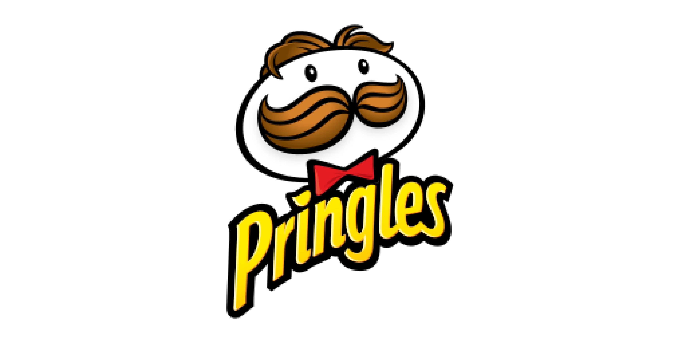

<div align="center">

</div>

<div align="center">

</div>

<div align="center">


</div>

---

<p align="center">
  <a href="#como-acessar-o-projeto">Visualizar Projeto</a>
</p>

---

## 🚀 Sobre o projeto

Uma landing page desenvolvida para a marca **Pringles**, recriando a identidade visual e o tom divertido da marca por meio de uma interface moderna, seções interativas de sabores e navegação fluida.

O projeto simula uma página promocional oficial da Pringles, apresentando os principais sabores da marca e reforçando o conceito clássico *"Once You Pop, You Can't Stop"*.

- Apresentação dos sabores em formato de carrossel
- Interface inspirada na identidade visual da marca
- Layout responsivo
- Seções de destaque com categorias de produto
- Estrutura moderna de landing page
- Navegação simples e objetiva

## 🧩 Tecnologias utilizadas

* **HTML**
* **CSS**
* **JavaScript**

## 🎨 Funcionalidades

* 🥔 Carrossel de sabores (Salt & Vinegar, Ham & Cheese, Paprika, Cheese & Onion)
* 🎯 Botões interativos (SEE MORE)
* 🔥 Seção "Once You Pop, You Can't Stop" com cards de categoria (Flavor, Blast, Iconic)
* 🧭 Header com navegação (Home, Promotions, Our Products, Contact)
* 🖼️ Uso de ícones e ilustrações SVG/WEBP para reforçar a identidade da marca

## 📱 Responsividade

O layout foi construído para se adaptar a diferentes tamanhos de tela, garantindo uma boa experiência tanto no mobile quanto no desktop.

<h2 id="como-acessar-o-projeto">⚙️ Como acessar o projeto</h2>

Acesse diretamente pelo GitHub Pages:

https://jarmeloo.github.io/PringlesLandingPage/

Ou, se preferir rodar localmente:

1. Clone o repositório:
```bash
git clone https://github.com/jarmeloo/PringlesLandingPage.git
```

2. Abra o arquivo:
```bash
index.html
```

3. Ou use uma extensão tipo **Live Server** no VS Code

## 🧠 Aprendizados

Durante esse projeto foram trabalhados conceitos como:

* Estruturação de landing pages temáticas
* Organização de seções e componentes reutilizáveis
* Boas práticas de HTML e CSS para páginas de produto
* Construção de interfaces responsivas

## 🧑‍💻 Autor

Johann Jarmelo
